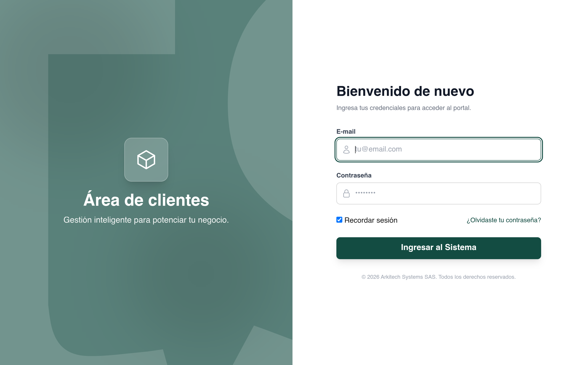

# clientarea Design System

You are building UI for **clientarea**. Light-themed, neutral palette, monospace typography (SFMono-Regular), compact density on a 4px grid, expressive motion.

## Visual Reference

**IMPORTANT**: Study ALL screenshots below before writing any UI. Match colors, typography, spacing, layout, and motion exactly as shown.

### Homepage



> Read `references/DESIGN.md` for full token details.

## Design Philosophy

- **Layered depth** — use shadow tokens to create a sense of physical layering. Each elevation level has a specific shadow.
- **Gradient accents** — gradients are used thoughtfully for emphasis, not decoration.
- **compact density** — 4px base grid. Every dimension is a multiple of 4.
- **neutral palette** — the color temperature runs neutral, matching the monospace typography.
- **Expressive motion** — animations are an integral part of the experience. Use spring physics and layout animations.

## Color System

### Core Palette

| Role | Token | Hex | Use |
|------|-------|-----|-----|
| Background | `--background` | `#ffffff` | Page/app background |
| Surface | `--surface` | `#9ca3af` | Cards, panels, modals |
| Text Primary | `--text-primary` | `#000000` | Headings, body text |

### Status Colors

| Status | Hex | Use |
|--------|-----|-----|
| Success | `#10b981` | Confirmations, positive trends |

### Extended Palette

- **tw-ring-color:** `#3b82f6`
- `#134c42`

### CSS Variable Tokens

```css
--border-btn: 1px;
--tab-border: 1px;
--border-btn: 1px;
--tab-border: 1px;
--border-btn: 1px;
--tab-border: 1px;
--border-btn: 1px;
--tab-border: 1px;
--glass-border-opacity: 15%;
--glass-border-opacity: 15%;
--tab-border-color: var(--fallback-b3,oklch(var(--b3)/1));
--togglehandleborder: 0 0;
--glass-border-opacity: 15%;
--glass-border-opacity: 15%;
--border-btn: 1px;
--tab-border: 1px;
--border-btn: 1px;
--tab-border: 1px;
--border-btn: 1px;
--tab-border: 1px;
```

## Typography

### Font Stack

- **SFMono-Regular** — Heading 1, Heading 2, Heading 3, Body, Caption, Code

### Type Scale

| Role | Family | Size | Weight |
|------|--------|------|--------|
| Heading 1 | SFMono-Regular | 8rem | 700 |
| Heading 2 | SFMono-Regular | 3.75rem | 700 |
| Heading 3 | SFMono-Regular | 3rem | 700 |
| Body | SFMono-Regular | .875rem | 400 |
| Caption | SFMono-Regular | .75rem | 400 |
| Code | SFMono-Regular | 14px | 400 |

### Typography Rules

- All text uses **SFMono-Regular** — never add another font family
- Max 3-4 font sizes per screen
- Headings: weight 600-700, body: weight 400
- Use color and opacity for text hierarchy, not additional font sizes
- Line height: 1.5 for body, 1.2 for headings

## Spacing & Layout

### Base Grid: 4px

Every dimension (margin, padding, gap, width, height) must be a multiple of **4px**.

### Spacing Scale

`2, 4, 6, 8, 10, 12, 14, 16, 20, 24, 28, 30` px

### Spacing as Meaning

| Spacing | Use |
|---------|-----|
| 4-8px | Tight: related items (icon + label, avatar + name) |
| 12-16px | Medium: between groups within a section |
| 24-32px | Wide: between distinct sections |
| 48px+ | Vast: major page section breaks |

### Border Radius

Scale: `inherit, unset, .25rem, .5rem, .75rem, 1rem, 1.5rem, 40px`
Default: `.75rem`

### Container

Max-width: `80rem`, centered with auto margins.

### Breakpoints

| Name | Value |
|------|-------|
| sm | 640px |
| md | 768px |
| lg | 1024px |
| xl | 1280px |
| 2xl | 1536px |

Mobile-first: design for small screens, layer on responsive overrides.

## Component Patterns

### Card

```css
.card {
  background: #9ca3af;
  border-radius: .75rem;
  padding: 16px;
  box-shadow: 0 0 0 4px var(--fallback-b1,oklch(var(--b1)/1)) inset,0 0 0 4px var(--fallback-b1,oklch(var(--b1)/1)) inset;
}
```

```html
<div class="card">
  <h3>Card Title</h3>
  <p>Card content goes here.</p>
</div>
```

### Button

```css
/* Primary */
.btn-primary {
  background: #cccccc;
  color: #000000;
  border-radius: .75rem;
  padding: 8px 16px;
  font-weight: 500;
  transition: opacity 150ms ease;
}
.btn-primary:hover { opacity: 0.9; }

/* Ghost */
.btn-ghost {
  background: transparent;
  border: 1px solid #cccccc;
  color: #000000;
  border-radius: .75rem;
  padding: 8px 16px;
}
```

```html
<button class="btn-primary">Get Started</button>
<button class="btn-ghost">Learn More</button>
```

### Input

```css
.input {
  background: #ffffff;
  border: 1px solid #cccccc;
  border-radius: .75rem;
  padding: 8px 12px;
  color: #000000;
  font-size: 14px;
}
.input:focus { border-color: var(--accent); outline: none; }
```

```html
<input class="input" type="text" placeholder="Search..." />
```

### Badge / Chip

```css
.badge {
  display: inline-flex;
  align-items: center;
  padding: 4px 8px;
  border-radius: 9999px;
  font-size: 12px;
  font-weight: 500;
  background: #9ca3af;
  color: #000000;
}
```

```html
<span class="badge">New</span>
<span class="badge">Beta</span>
```

### Modal / Dialog

```css
.modal-backdrop { background: rgba(0, 0, 0, 0.6); }
.modal {
  background: #9ca3af;
  border-radius: 40px;
  padding: 24px;
  max-width: 480px;
  width: 90vw;
  box-shadow: 0 0 0 12px var(--fallback-b1,oklch(var(--b1)/1)) inset,0 0 0 12px var(--fallback-b1,oklch(var(--b1)/1)) inset;
}
```

```html
<div class="modal-backdrop">
  <div class="modal">
    <h2>Dialog Title</h2>
    <p>Dialog content.</p>
    <button class="btn-primary">Confirm</button>
    <button class="btn-ghost">Cancel</button>
  </div>
</div>
```

### Table

```css
.table { width: 100%; border-collapse: collapse; }
.table th {
  text-align: left;
  padding: 8px 12px;
  font-weight: 500;
  font-size: 12px;
  color: #000000;
  text-transform: uppercase;
  letter-spacing: 0.05em;
  border-bottom: 1px solid #cccccc;
}
.table td {
  padding: 12px;
  border-bottom: 1px solid #cccccc;
}
```

```html
<table class="table">
  <thead><tr><th>Name</th><th>Status</th><th>Date</th></tr></thead>
  <tbody>
    <tr><td>Item One</td><td>Active</td><td>Jan 1</td></tr>
    <tr><td>Item Two</td><td>Pending</td><td>Jan 2</td></tr>
  </tbody>
</table>
```

### Navigation

```css
.nav {
  display: flex;
  align-items: center;
  gap: 8px;
  padding: 12px 16px;
}
.nav-link {
  color: #000000;
  padding: 8px 12px;
  border-radius: .75rem;
  transition: color 150ms;
}
.nav-link:hover { color: #000000; }
```

```html
<nav class="nav">
  <a href="/" class="nav-link active">Home</a>
  <a href="/about" class="nav-link">About</a>
  <a href="/pricing" class="nav-link">Pricing</a>
  <button class="btn-primary" style="margin-left: auto">Get Started</button>
</nav>
```

### Extracted Components

These components were found in the codebase:

**Button** (`html`)
- Variants: `primary`

**Input** (`html`)

## Page Structure

The following page sections were detected:

- **Hero** — Hero section (detected from heading structure)

When building pages, follow this section order and structure.

## Animation & Motion

This project uses **expressive motion**. Animations are part of the design language.

### CSS Animations

- `button-pop`
- `checkmark`
- `modal-pop`
- `progress-loading`
- `radiomark`

### Motion Tokens

- **Duration scale:** `.15s`, `.2s`, `.3s`, `.5s`, `200ms`
- **Easing functions:** `cubic-bezier(.4,0,.2,1)`, `cubic-bezier(0,0,.2,1)`, `ease-out`, `cubic-bezier(.8,0,1,1)`
- **Animated properties:** `grid-template-rows`

### Motion Guidelines

- **Duration:** Use values from the duration scale above. Short (.15s) for micro-interactions, long (200ms) for page transitions
- **Easing:** Use `cubic-bezier(.4,0,.2,1)` as the default easing curve
- **Direction:** Elements enter from bottom/right, exit to top/left
- **Reduced motion:** Always respect `prefers-reduced-motion` — disable animations when set

## Depth & Elevation

### Shadow Tokens

- Subtle: `var(--handleoffsetcalculator)0 0 2px var(--tglbg) inset,0 0 0 2px var(--tglbg) inset,var(--togglehandleborder)`
- Subtle: `2px 2px`
- Subtle: `calc(var(--handleoffset)/2)0 0 2px var(--tglbg) inset,calc(var(--handleoffset)/-2)0 0 2px var(--tglbg) inset,0 0 0 2px var(--tglbg) inset`
- Subtle: `0 0 0 1px rgb(255 255 255/var(--glass-border-opacity,10%)) inset,0 0 0 2px rgb(0 0 0/5%)`
- Raised (cards, buttons): `0 0 0 4px var(--fallback-b1,oklch(var(--b1)/1)) inset,0 0 0 4px var(--fallback-b1,oklch(var(--b1)/1)) inset`
- Raised (cards, buttons): `0 0 0 3px var(--fallback-b1,oklch(var(--b1)/1)) inset,0 0 0 3px var(--fallback-b1,oklch(var(--b1)/1)) inset`

### Z-Index Scale

`0, 1, 10, 20, 40, 50, 100, 999`

Use these exact values — never invent z-index values.

## Anti-Patterns (Never Do)

- **No blur effects** — no backdrop-blur, no filter: blur()
- **No zebra striping** — tables and lists use borders for separation
- **No invented colors** — every hex value must come from the palette above
- **No arbitrary spacing** — every dimension is a multiple of 4px
- **No extra fonts** — only SFMono-Regular are allowed
- **No arbitrary border-radius** — use the scale: .25rem, .5rem, .75rem, 1rem, 1.5rem, 40px
- **No opacity for disabled states** — use muted colors instead

## Workflow

1. **Read** `references/DESIGN.md` before writing any UI code
2. **Pick colors** from the Color System section — never invent new ones
3. **Set typography** — SFMono-Regular only, using the type scale
4. **Build layout** on the 4px grid — check every margin, padding, gap
5. **Match components** to patterns above before creating new ones
6. **Apply elevation** — use shadow tokens
7. **Validate** — every value traces back to a design token. No magic numbers.

## Brand Spec

- **Favicon:** `/favicon.ico`
- **Site URL:** `https://clientarea.atsys.co`

## Quick Reference

```
Background:     #ffffff
Surface:        #9ca3af
Text:           #000000 / (not extracted)
Accent:         (not extracted)
Border:         (not extracted)
Font:           SFMono-Regular
Spacing:        4px grid
Radius:         .75rem
Components:     4 detected
```

## When to Trigger

Activate this skill when:
- Creating new components, pages, or visual elements for clientarea
- Writing CSS, Tailwind classes, styled-components, or inline styles
- Building page layouts, templates, or responsive designs
- Reviewing UI code for design consistency
- The user mentions "clientarea" design, style, UI, or theme
- Generating mockups, wireframes, or visual prototypes

---

# Full Reference Files

> Every output file is embedded below. Claude has full design system context from /skills alone.

## Design System Tokens (DESIGN.md)

# clientarea DESIGN.md

> Auto-generated design system — reverse-engineered via static analysis by skillui.
> Frameworks: None detected
> Colors: 6 · Fonts: 1 · Components: 4
> Icon library: not detected · State: not detected
> Primary theme: light · Dark mode toggle: no · Motion: expressive

## Visual Reference

**Match this design exactly** — study colors, fonts, spacing, and component shapes before writing any UI code.


---

## 1. Visual Theme & Atmosphere

This is a **light-themed** interface with a neutral, approachable feel. The light background emphasizes content clarity. Typography uses **SFMono-Regular** throughout — a technical, developer-focused choice that maintains consistency. Spacing follows a **4px base grid** (compact density), with scale: 2, 4, 6, 8, 10, 12, 14, 16px. Motion is expressive — spring physics, layout animations, and staggered reveals are part of the visual language.

---

## 2. Color Palette & Roles

| Token | Hex | Role | Use |
|---|---|---|---|
| tw-ring-offset-color | `#ffffff` | background | Page background, darkest surface |
| surface | `#9ca3af` | surface | Card and panel backgrounds |
| text-primary | `#000000` | text-primary | Headings and body text |
| success | `#10b981` | success | Success states, positive indicators |
| tw-ring-color | `#3b82f6` | info | Informational highlights |
| unknown | `#134c42` | unknown | Palette color |

### CSS Variable Tokens

```css
--tw-border-spacing-x: 0;
--tw-border-spacing-y: 0;
--tw-border-spacing-x: 0;
--tw-border-spacing-y: 0;
--border-btn: 1px;
--tab-border: 1px;
--border-btn: 1px;
--tab-border: 1px;
--border-btn: 1px;
--tab-border: 1px;
--border-btn: 1px;
--tab-border: 1px;
--tw-border-opacity: 1;
--tw-border-opacity: 1;
--tw-border-opacity: 1;
--tw-border-opacity: 1;
--tw-border-opacity: 1;
--tw-border-opacity: 1;
--tw-border-opacity: 1;
--tw-border-opacity: 1;
```


---

## 3. Typography Rules

**Font Stack:**
- **SFMono-Regular** — Heading 1, Heading 2, Heading 3, Body, Caption, Code

| Role | Font | Size | Weight |
|---|---|---|---|
| Heading 1 | SFMono-Regular | 8rem | 700 |
| Heading 2 | SFMono-Regular | 3.75rem | 700 |
| Heading 3 | SFMono-Regular | 3rem | 700 |
| Body | SFMono-Regular | .875rem | 400 |
| Caption | SFMono-Regular | .75rem | 400 |
| Code | SFMono-Regular | 14px | 400 |

**Typographic Rules:**
- Use **SFMono-Regular** for all text — do not mix font families
- Maintain consistent hierarchy: no more than 3-4 font sizes per screen
- Headings use bold (600-700), body uses regular (400)
- Line height: 1.5 for body text, 1.2 for headings
- Use color and opacity for secondary hierarchy, not additional font sizes


---

## 4. Component Stylings

### Data Display (1)

**Badge** — `html`

### Data Input (2)

**Button** — `html`
- Variants: `primary`
- Animation: 

**Input** — `html`
- State: :focus, :placeholder

### Media (1)

**Icon** — `html`


---

## 5. Layout Principles

- **Base spacing unit:** 4px
- **Spacing scale:** 2, 4, 6, 8, 10, 12, 14, 16, 20, 24, 28, 30
- **Border radius:** inherit, unset, .25rem, .5rem, .75rem, 1rem, 1.5rem, 40px
- **Max content width:** 80rem

**Spacing as Meaning:**
| Spacing | Use |
|---|---|
| 4-8px | Tight: related items within a group |
| 12-16px | Medium: between groups |
| 24-32px | Wide: between sections |
| 48px+ | Vast: major section breaks |


---

## 6. Depth & Elevation

### Flat — subtle depth hints

- `var(--handleoffsetcalculator)0 0 2px var(--tglbg) inset,0 0 0 2px var(--tglbg) inset,var(--togglehandleborder)`
- `2px 2px`
- `calc(var(--handleoffset)/2)0 0 2px var(--tglbg) inset,calc(var(--handleoffset)/-2)0 0 2px var(--tglbg) inset,0 0 0 2px var(--tglbg) inset`

### Raised — cards, buttons, interactive elements

- `0 0 0 4px var(--fallback-b1,oklch(var(--b1)/1)) inset,0 0 0 4px var(--fallback-b1,oklch(var(--b1)/1)) inset`
- `0 0 0 3px var(--fallback-b1,oklch(var(--b1)/1)) inset,0 0 0 3px var(--fallback-b1,oklch(var(--b1)/1)) inset`
- `0 0 0 3px var(--range-shdw) inset,var(--focus-shadow,0 0),calc(var(--filler-size)*-1 - var(--filler-offset))0 0 var(--filler-size)`

### Floating — dropdowns, popovers, modals

- `0 0 0 12px var(--fallback-b1,oklch(var(--b1)/1)) inset,0 0 0 12px var(--fallback-b1,oklch(var(--b1)/1)) inset`

### Overlay — full-screen overlays, top-level dialogs

- `0 25px 50px -12px rgba(0,0,0,.25)`

### Z-Index Scale

`0, 1, 10, 20, 40, 50, 100, 999`


---

## 7. Animation & Motion

This project uses **expressive motion**. Animations are an integral part of the experience.

### CSS Animations

- `@keyframes button-pop`
- `@keyframes checkmark`
- `@keyframes modal-pop`
- `@keyframes progress-loading`
- `@keyframes radiomark`
- `@keyframes rating-pop`
- `@keyframes skeleton`
- `@keyframes toast-pop`

### Animated Components

- **Button**: 

### Motion Guidelines

- Duration: 150-300ms for micro-interactions, 300-500ms for page transitions
- Easing: `ease-out` for enters, `ease-in` for exits
- Always respect `prefers-reduced-motion`


---

## 8. Do's and Don'ts

### Do's

- Use `#ffffff` as the primary page background
- Follow the **4px** spacing grid for all margins, padding, and gaps
- Use the defined shadow tokens for elevation — see Section 6
- Use border-radius from the scale: inherit, unset, .25rem, .5rem, .75rem
- Reuse existing components from Section 4 before creating new ones

### Don'ts

- Don't introduce colors outside this palette — extend the design tokens first
- Don't use arbitrary spacing values — stick to multiples of 4px
- Don't create custom box-shadow values outside the system tokens
- Don't use arbitrary border-radius values — pick from the defined scale
- Don't duplicate component patterns — check Section 4 first
- Don't use backdrop-blur or blur effects

### Anti-Patterns (detected from codebase)

- No blur or backdrop-blur effects
- No zebra striping on tables/lists


---

## 9. Responsive Behavior

| Name | Value | Source |
|---|---|---|
| sm | 640px | css |
| md | 768px | css |
| lg | 1024px | css |
| xl | 1280px | css |
| 2xl | 1536px | css |

**Approach:** Use `@media (min-width: ...)` queries matching the breakpoints above.


---

## 10. Agent Prompt Guide

Use these as starting points when building new UI:

### Build a Card

```
Background: #9ca3af
Border: 1px solid var(--border)
Radius: .75rem
Padding: 16px
Font: SFMono-Regular
Use shadow tokens from Section 6.
```

### Build a Button

```
Primary: bg var(--accent), text white
Ghost: bg transparent, border var(--border)
Padding: 8px 16px
Radius: .75rem
Hover: opacity 0.9 or lighter shade
Focus: ring with var(--accent)
```

### Build a Page Layout

```
Background: #ffffff
Max-width: 80rem, centered
Grid: 4px base
Responsive: mobile-first, breakpoints from Section 9
```

### Build a Stats Card

```
Surface: #9ca3af
Label: var(--text-muted) (muted, 12px, uppercase)
Value: #000000 (primary, 24-32px, bold)
Status: use success/warning/danger from Section 2
```

### Build a Form

```
Input bg: #ffffff
Input border: 1px solid var(--border)
Focus: border-color var(--accent)
Label: var(--text-muted) 12px
Spacing: 16px between fields
Radius: .75rem
```

### General Component

```
1. Read DESIGN.md Sections 2-6 for tokens
2. Colors: only from palette
3. Font: SFMono-Regular, type scale from Section 3
4. Spacing: 4px grid
5. Components: match patterns from Section 4
6. Elevation: shadow tokens
```

## Homepage Screenshots (screenshots/)


